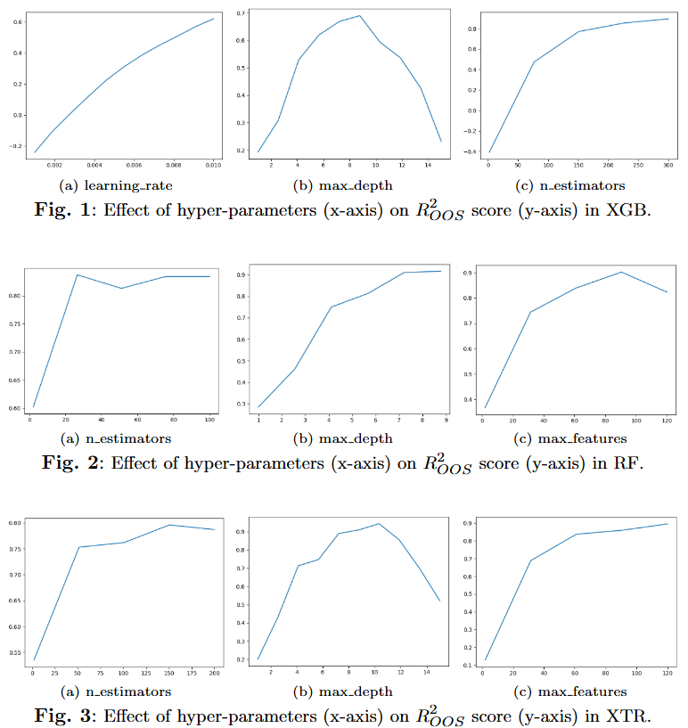
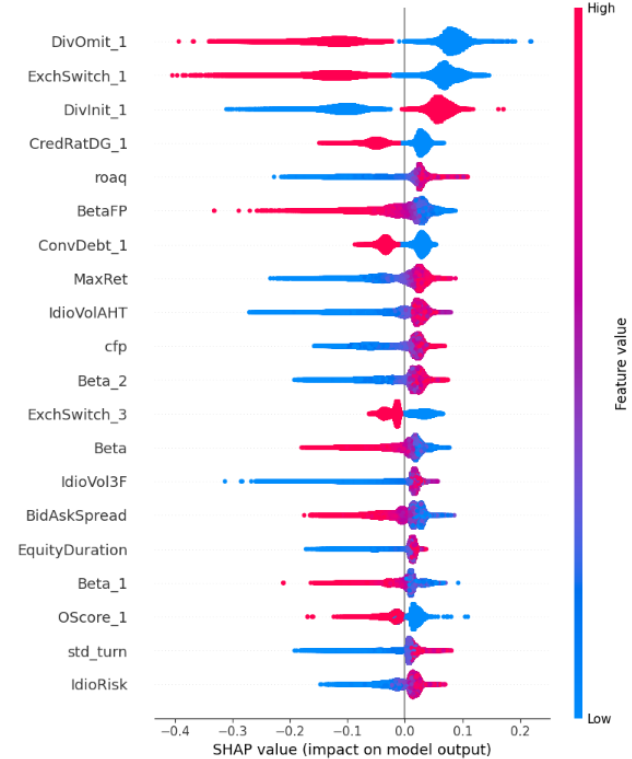
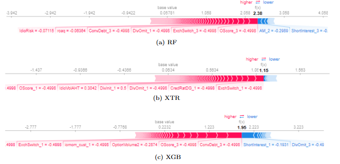
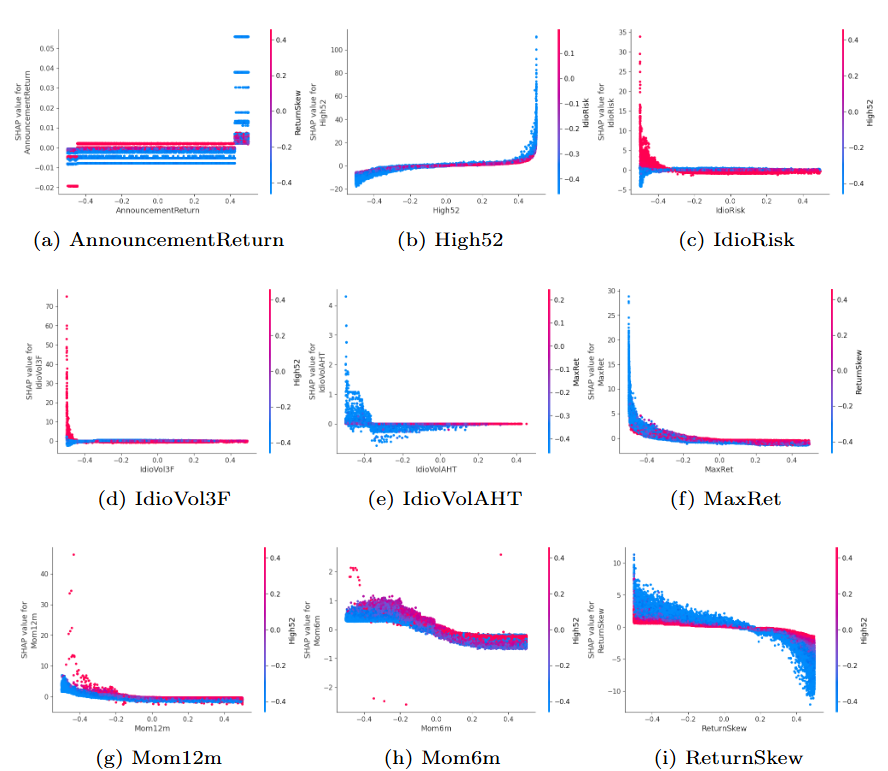

# Significance-of-Predictors-Revisiting-Stock-Return-Predictions-Using-Explainable-AI
This repository contains the code, datasets, and analysis for the paper "Significance of Predictors: Revisiting Stock Return Predictions Using Explainable AI". 

## Requirements
- `numpy` >= 1.23.4
- `pandas` >= 1.5.1
- `scikit-learn` >= 1.1.3
- `matplotlib` >= 3.6.2
- `tensorflow` == 2.11.0
- `keras` == 2.11.0
- `xgboost` == 1.7.1
- `shap' == 0.41.0

## Data
The initial raw monthly data of firm fundamentals can be downloaded from [here](https://sites.google.com/site/chenandrewy/). 

The monthly macroeconomic data can be downloaded from [here](https://sites.google.com/view/agoyal145).

Python implementation of the data preprocessing pipeline is presented in [Preprocessing.ipynb](#).

Scripts for cleaning, preprocessing, structuring financial datasets, and handling missing data. Code to align predictors with stock return data over various historical periods. Applied PCA on Macroeconomic variables and interaction terms of the first 3 PCs with the original predictors is created. The original predictors are also part of the final dataset.

A **Demo Dataset** is provided [here](https://drive.google.com/file/d/1W1O6-ux1nVvR9eUWgCUwXfYahng34ls1/view?usp=sharing) due to the large size of the original data. It contains 1000 randomly selected firm IDs and their fundamentals along with the interaction terms (with the PCs of the macroeconomic variables).

## Predictive Performance
Python implementation of the models used in the paper is presented in [Predictive Performance.ipynb](#).

Scripts where the battery of ML models (Linear Regression, Extra Tree Regressor, Random Forest Regressor, XGBoost Regressor, Set of Neural Networks) are used to predict the variety of dependent variables. Their prediction metrics are reported as Mean Absolute Error, Mean Squared Error, and R2 Score both in-sample (on the train set) and out-of-sample (on the test set).

## Hyperparameter Tuning

## Demonstration of SHAP

### Global Feature Importance

This figure provides the global feature importance of the top 20 features that have a significant effect on the dependent variable. The blue (red) demarcates the positive (negative) contribution of the feature on the final prediction.
### Local Feature Importance

### Non-linear Feature Interaction (Using Dependence Plots)

